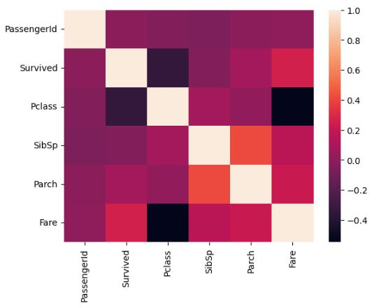

# Exploratory-Data-Analysis

**This project will help in developing the skills in data visualization and basic data cleaning.**

1. Load the required libraries: The necessary libraries are imported to the code to perform data analysis and visualization.

2. Load the dataset: The Titanic dataset is loaded into a Pandas dataframe using the **pd.read_csv()** function.

3. View the dataset: The **.head()** method is used to display the first five rows of the dataframe.

4. Basic information of the dataset: The **.info()** method is used to display the basic information of the dataset, such as the number of rows, columns, and data types of the columns.

5. Describe the dataset: The **.describe()** method is used to display some basic statistical information of the dataset.

6. Find the duplicates: The **.duplicated().sum()** method is used to count the number of duplicated rows in the dataset.

7. Unique values in the columns: The **.unique()** method is used to find the unique values in the **'Pclass'** column.

8. Visualize the values using seaborn: The **sns.countplot()** function is used to create a count plot of the **'Sex'** column.

9. Find the null values: The **.isnull().sum()** method is used to count the number of null values in each column of the dataset.

10. Replace the null values with **0**: The **.replace()** method is used to replace the null values in the dataframe with **0**.

11. Find the null values: The **.isnull().sum()** method is used again to confirm that there are no null values in the dataframe.

12. Data types: The **.dtypes** method is used to display the data types of each column in the dataframe.

13. Filter the data based on some logic: The dataframe is filtered to show only the rows where the **'Pclass'** column is equal to **2**.

14. Boxplot: The **.boxplot()** method is used to create a boxplot of the **'Fare'** column.

15. Correlation: The **.corr()** method is used to calculate the correlation between the columns of the dataframe.

16. Correlation plot: The **sns.heatmap()** function is used to create a heatmap of the correlation matrix calculated in the previous step.
